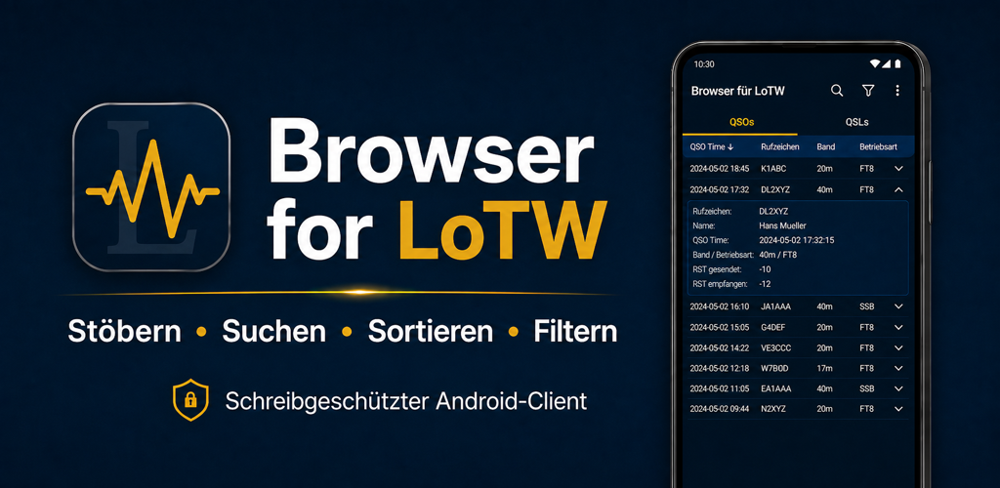
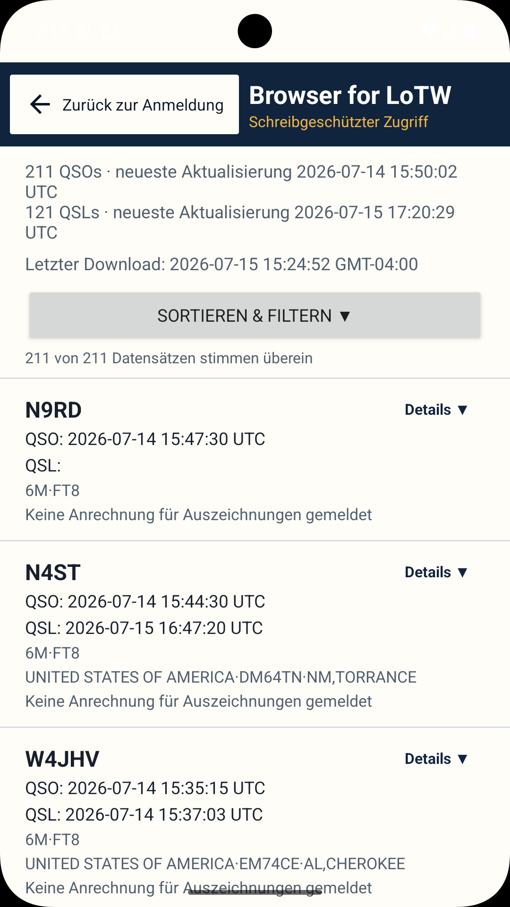
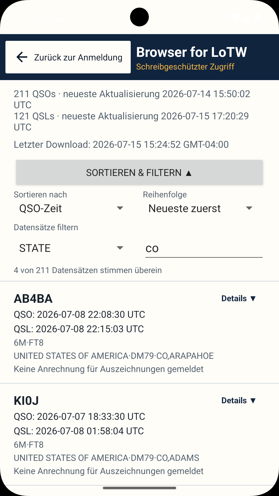
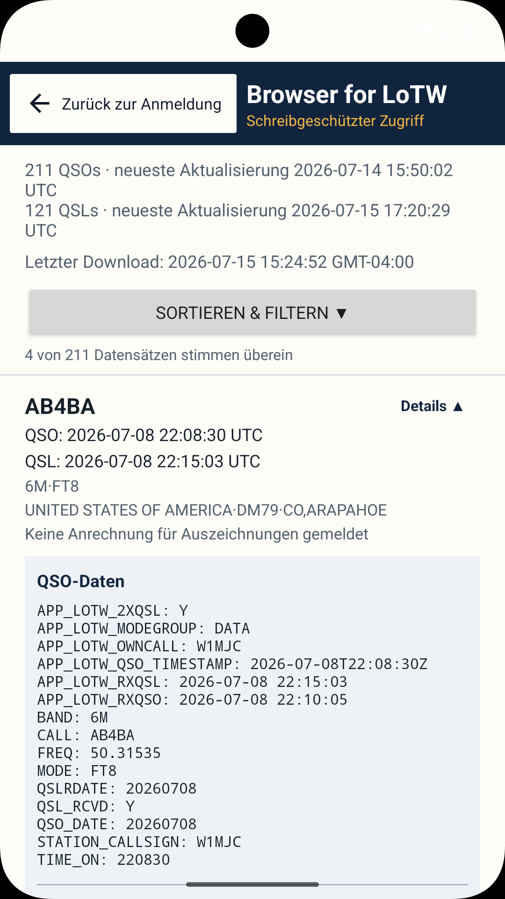
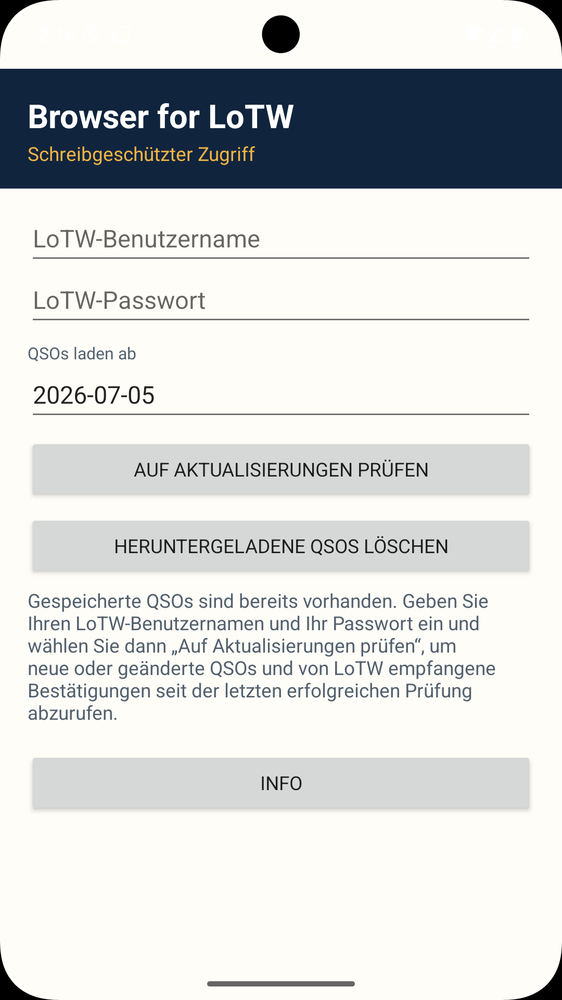
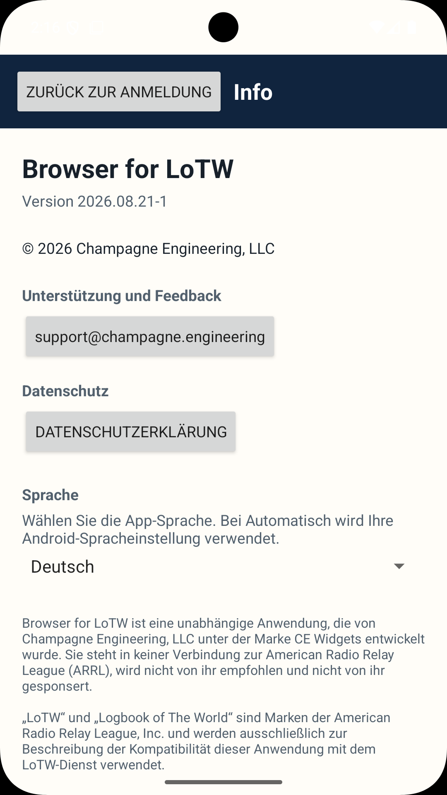

# Browser for LoTW

[English](README.md) · **Deutsch** · [Français](README.fr.md) · [Português](README.pt.md) · [Italiano](README.it.md) · [Español](README.es.md)

**Status:** 🟢 Produktion · **Version:** `2026.08.21-1`

Eine Android-Anwendung zum Durchsuchen, Suchen, Sortieren und Filtern von ARRL Logbook of The World (LoTW)-Datensätzen.

[Bei Google Play herunterladen](https://play.google.com/store/apps/details?id=engineering.champagne.browserforlotw)

## Screenshots

    

Die vollständige technische Dokumentation und die rechtlichen Hinweise sind auf [Englisch](README.md) verfügbar.
