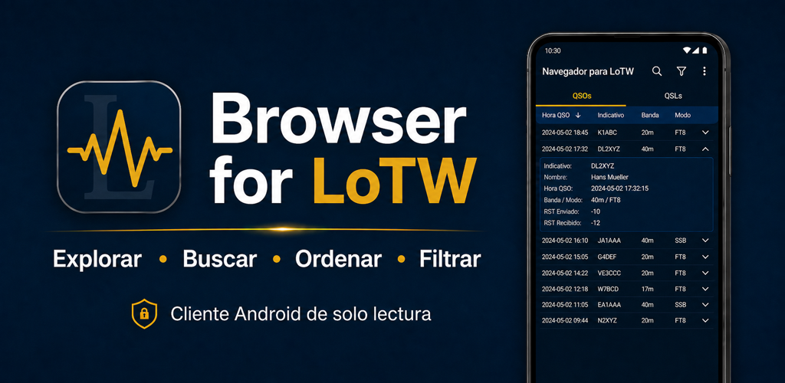
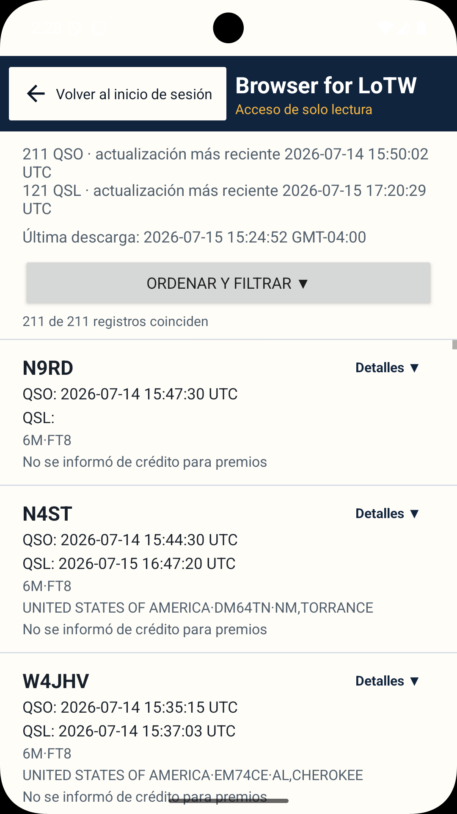
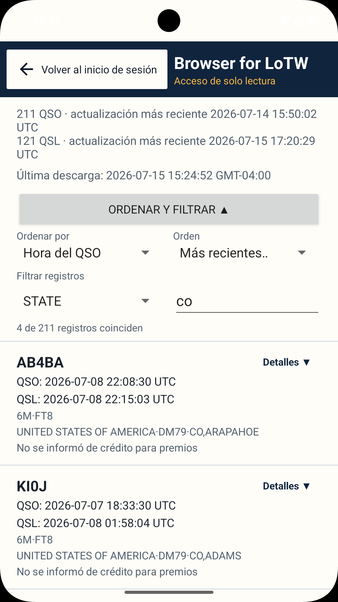
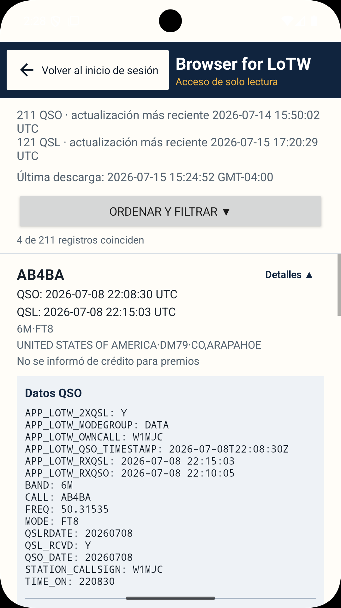
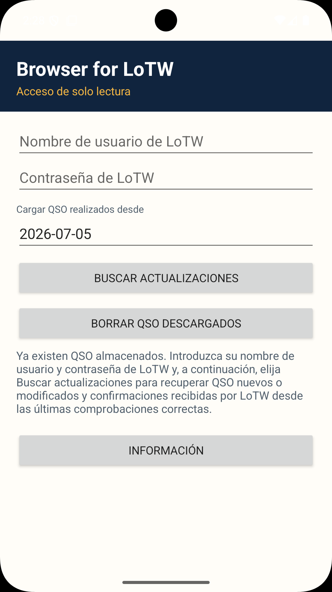
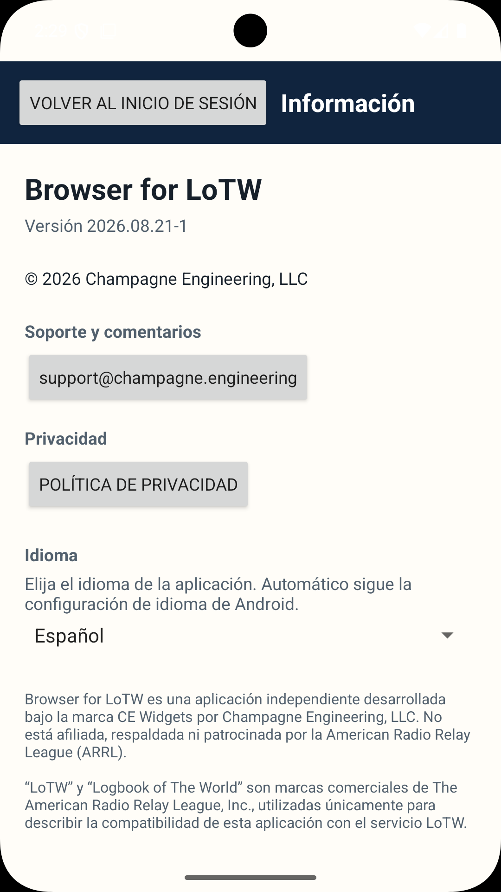

# Browser for LoTW

[English](README.md) · [Deutsch](README.de.md) · [Français](README.fr.md) · [Português](README.pt.md) · [Italiano](README.it.md) · **Español**

**Estado:** 🟢 Producción · **Versión:** `2026.08.21-1`

Una aplicación Android para explorar, buscar, ordenar y filtrar registros de ARRL Logbook of The World (LoTW).

[Disponible en Google Play](https://play.google.com/store/apps/details?id=engineering.champagne.browserforlotw)

## Capturas de pantalla

    

La documentación técnica completa y los avisos legales están disponibles en [inglés](README.md).
