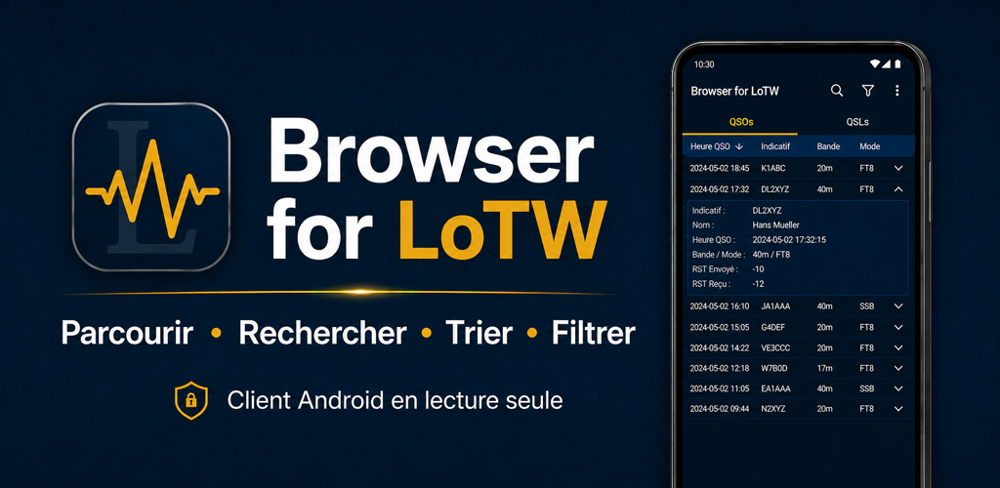
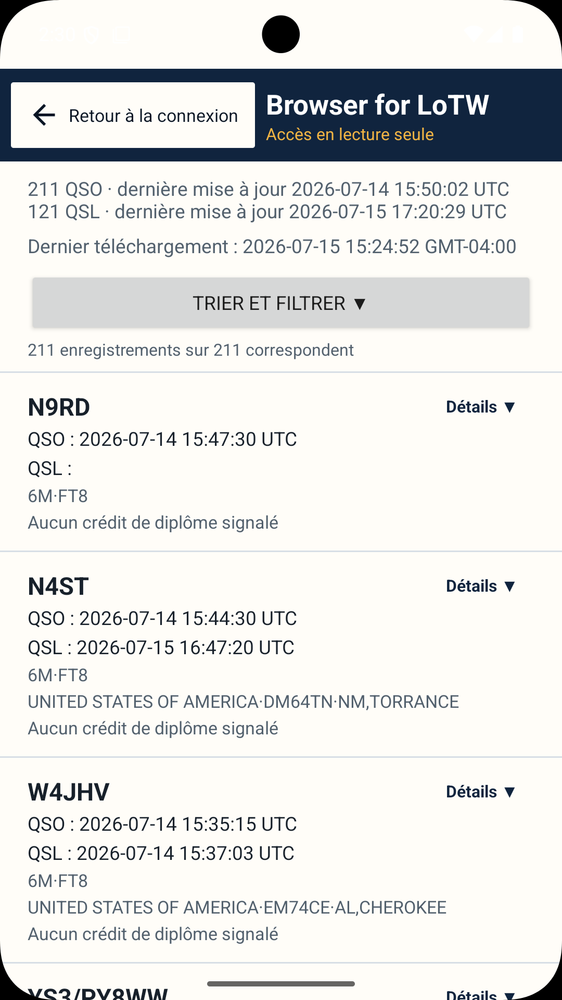
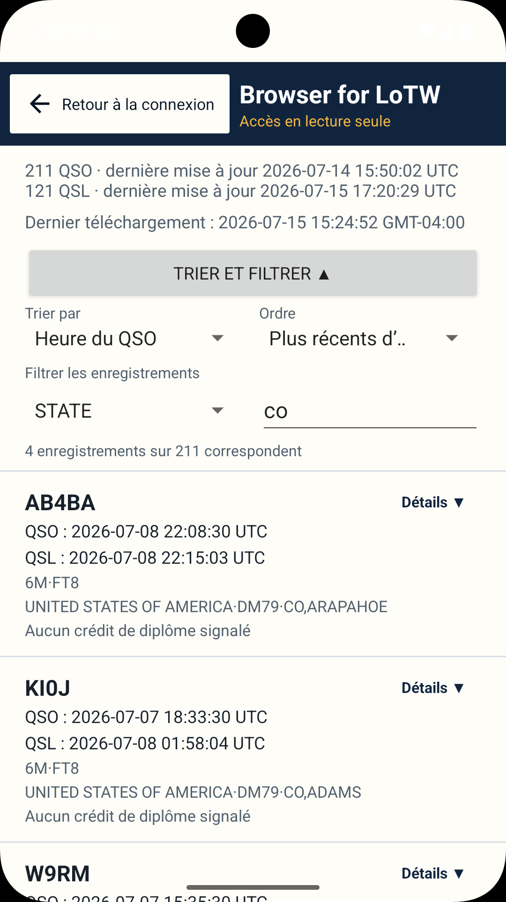
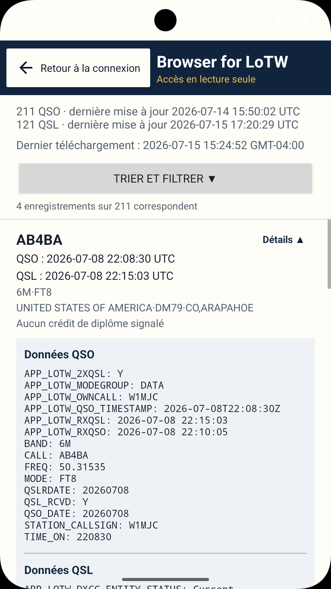
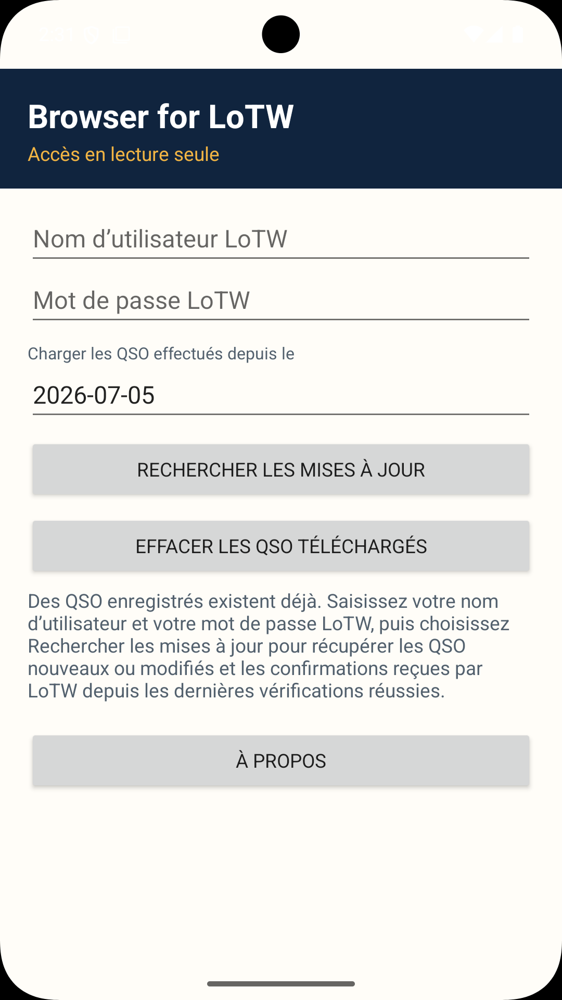
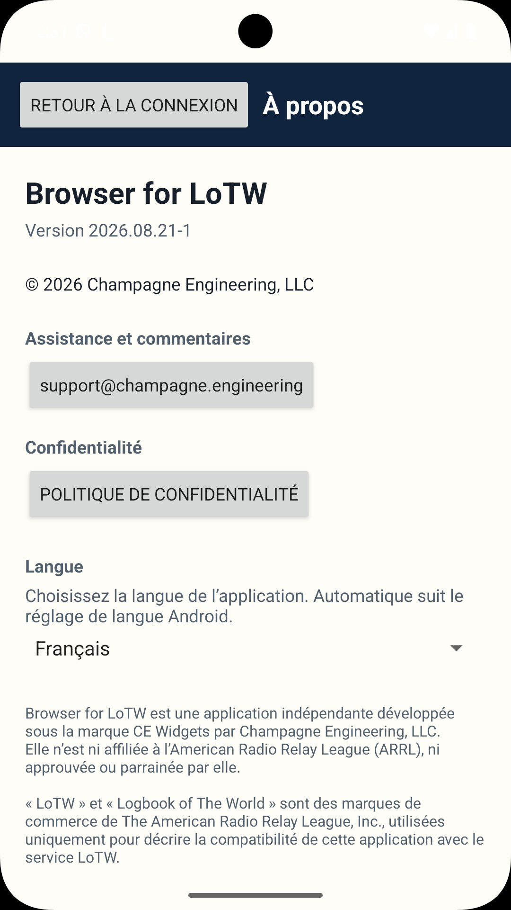

# Browser for LoTW

[English](README.md) · [Deutsch](README.de.md) · **Français** · [Português](README.pt.md) · [Italiano](README.it.md) · [Español](README.es.md)

**Statut :** 🟢 Production · **Version :** `2026.08.21-1`

Une application Android permettant de parcourir, rechercher, trier et filtrer les enregistrements ARRL Logbook of The World (LoTW).

[Disponible sur Google Play](https://play.google.com/store/apps/details?id=engineering.champagne.browserforlotw)

## Captures d’écran

    

La documentation technique complète et les mentions légales sont disponibles en [anglais](README.md).
