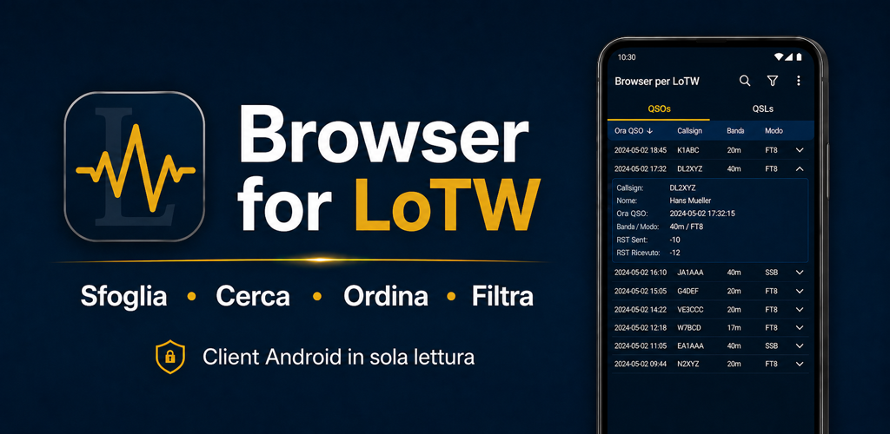
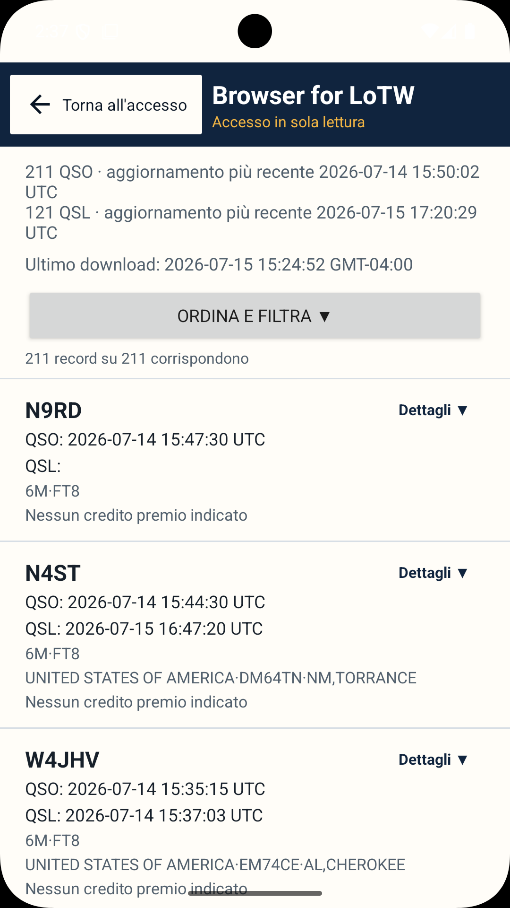
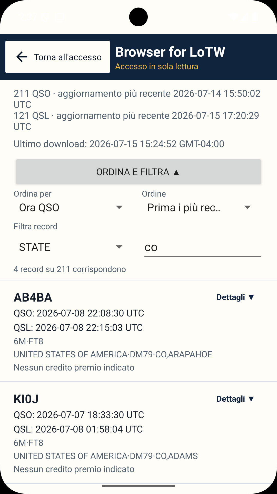
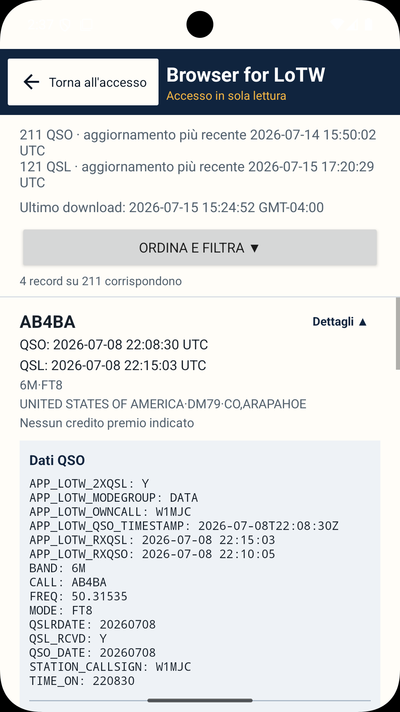
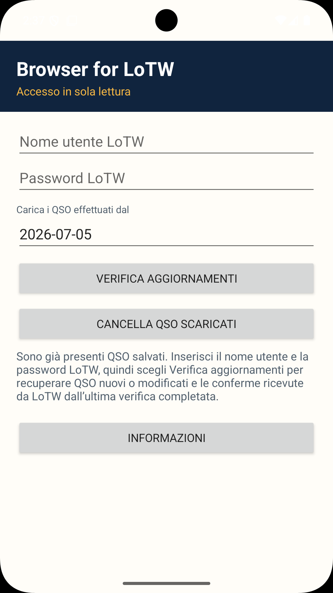
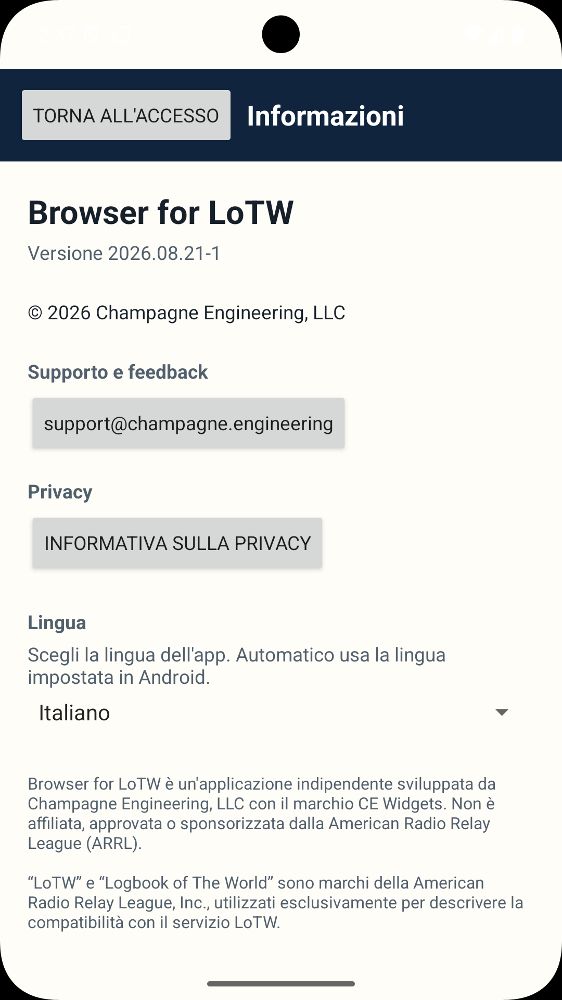

# Browser for LoTW

[English](README.md) · [Deutsch](README.de.md) · [Français](README.fr.md) · [Português](README.pt.md) · **Italiano** · [Español](README.es.md)

**Stato:** 🟢 Produzione · **Versione:** `2026.08.21-1`

Un’applicazione Android per consultare, cercare, ordinare e filtrare i record ARRL Logbook of The World (LoTW).

[Disponibile su Google Play](https://play.google.com/store/apps/details?id=engineering.champagne.browserforlotw)

## Schermate

    

La documentazione tecnica completa e le note legali sono disponibili in [inglese](README.md).
