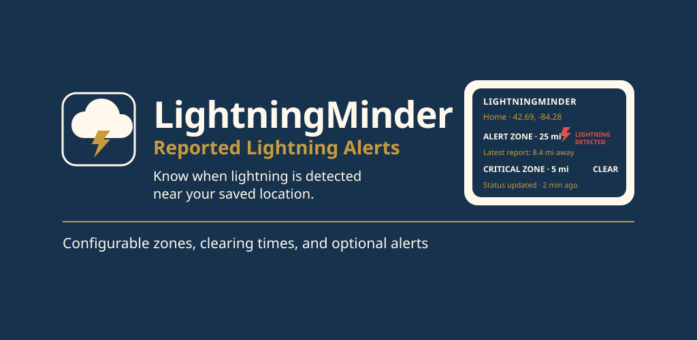
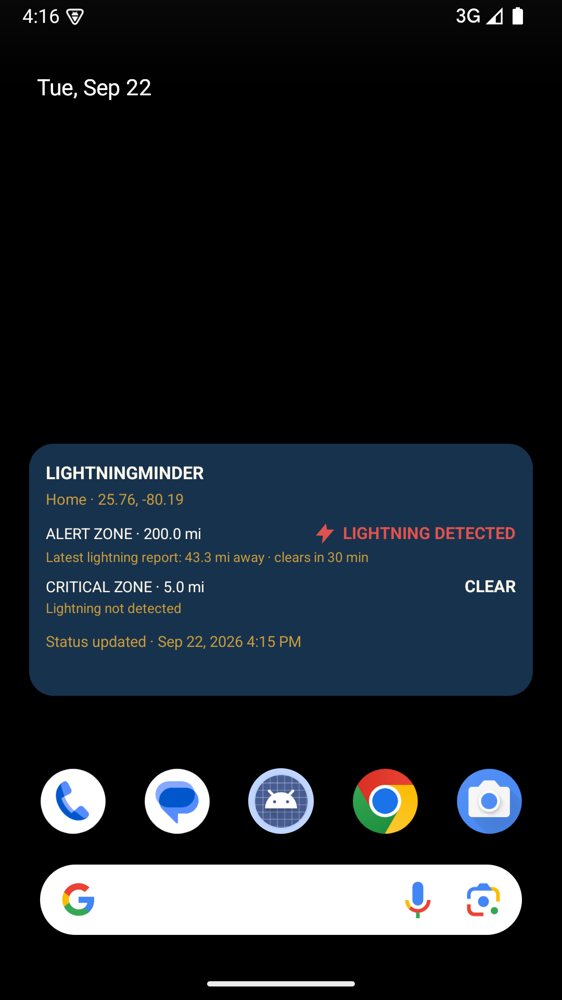
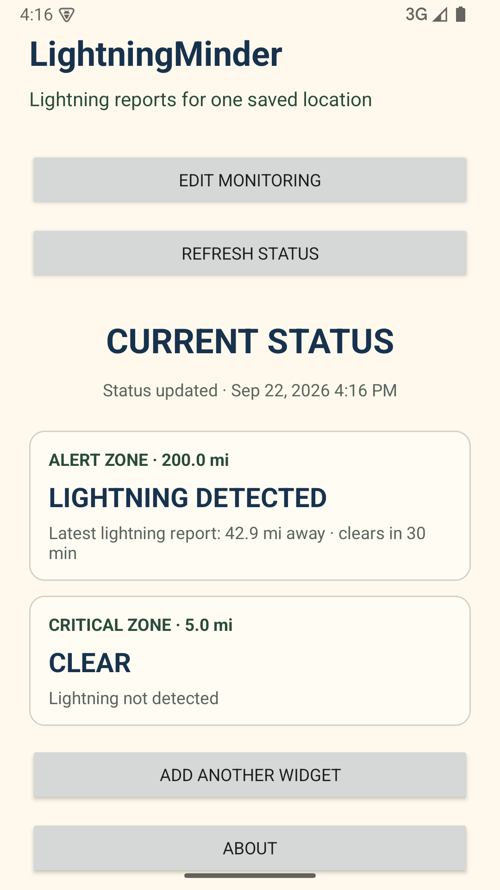
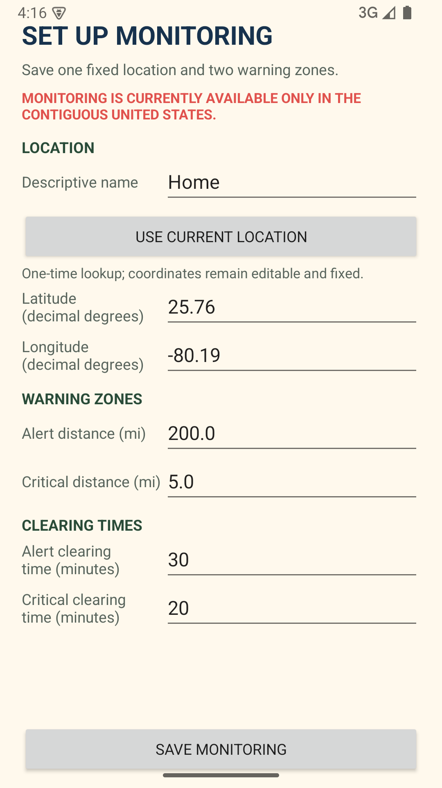
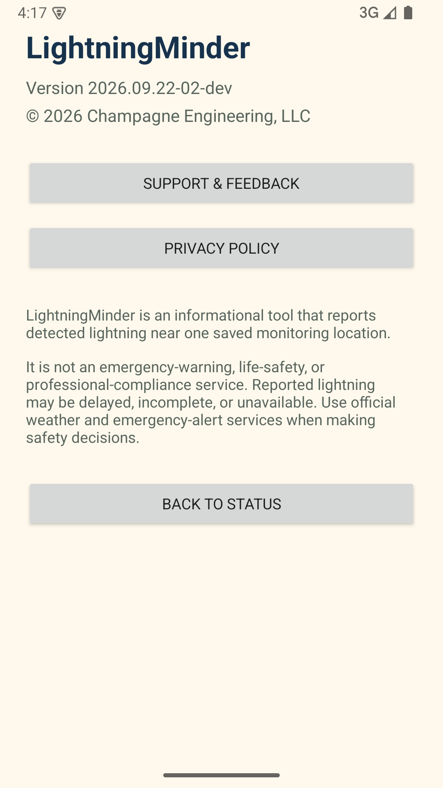

# LightningMinder

**Status:** 🟢 Production
**Current version:** `2026.09.23-05`

## Overview

LightningMinder is an Android monitoring tool for recently reported lightning
near one saved fixed location. It uses publicly available NOAA GOES-series
Geostationary Lightning Mapper (GLM) observations to show whether the
configured Alert or Critical zone is active, clear, or stale.

The home-screen widget is the primary at-a-glance view. It presents both zones,
their configured distances, the latest matching lightning report, clearing
time, and the time that status was last updated.

## Features

- One saved fixed monitoring location in the contiguous United States
- Configurable Alert and Critical zones with independent clearing times
- Resizable home-screen widget with current zone state and freshness
- Lightning-detected, clear, and stale-data status that remains explicit
- Optional notifications for Alert, Critical, Clear, Stale, and Recovered
  state transitions
- One-time current-location lookup; no continuous device-location tracking
- Cached state for temporary connectivity interruptions
- Firebase-protected push subscriptions for background state notifications

## Screenshots

  
  
  
  

## Repository Purpose

This public repository contains LightningMinder documentation, release notes,
store graphics, screenshots, and issue-tracking material. It does not contain
the Android application source code, backend implementation, Firebase
configuration, or deployment credentials.

## Resources

- [Release Notes](docs/release-notes.md)
- [Documentation](docs/README.md)
- [Google Play](https://play.google.com/store/apps/details?id=engineering.champagne.lightningminder)
- [LightningMinder product page](https://champagne.engineering/lightningminder)
- [Privacy Policy](https://champagne.engineering/privacy)
- [Terms of Service](https://champagne.engineering/tos)

## Support

Website: https://champagne.engineering 
Email: support@champagne.engineering

## Important Notice

LightningMinder reports recent lightning activity detected by the NOAA
GOES-series Geostationary Lightning Mapper near one saved location. It is not
an emergency-warning, life-safety, weather-forecasting, professional-compliance,
or ground-strike-confirmation service. Reports and notifications may be delayed,
incomplete, unavailable, or incorrect. Use official weather forecasts, warnings,
emergency-alert services, and applicable local procedures for safety decisions.

NOAA does not endorse, sponsor, or operate LightningMinder. LightningMinder's
derived status is not an official NOAA product.

## Copyright

© 2026 Champagne Engineering, LLC. All rights reserved.

LightningMinder is an independent application developed under the CE Widgets
brand by Champagne Engineering, LLC.
