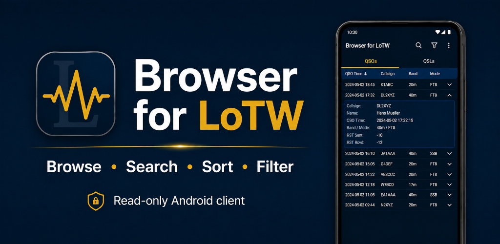
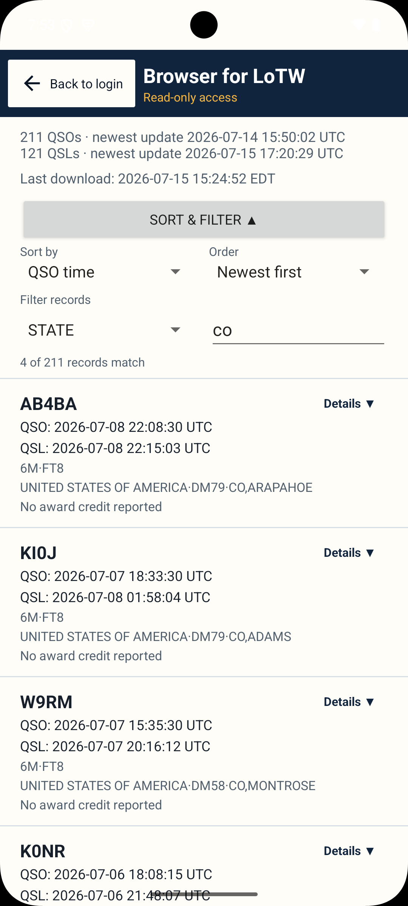
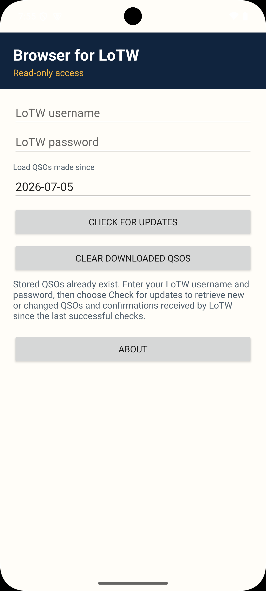
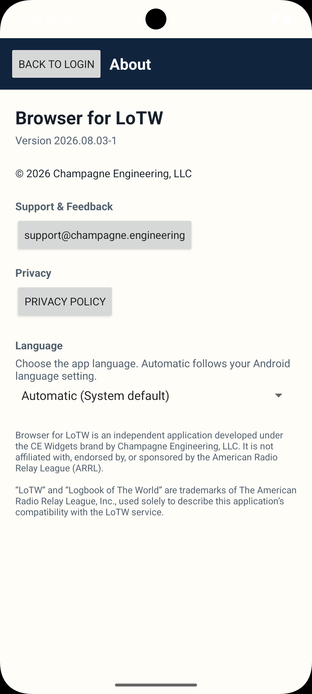

# Browser for LoTW

[English](README.md) · [Deutsch](README.de.md) · [Français](README.fr.md) · [Português](README.pt.md) · [Italiano](README.it.md) · [Español](README.es.md)

**Status:** 🟢 Production
**Current version:** `2026.08.21-1`

## Google Play

[Get it on Google Play](https://play.google.com/store/apps/details?id=engineering.champagne.browserforlotw)

## Overview

Browser for LoTW is an Android application for browsing, searching, sorting, and filtering ARRL Logbook of The World (LoTW) records.

Available now on Google Play.

## Features

- Download LoTW records directly from ARRL
- Browse QSOs and QSLs
- Advanced sorting and filtering
- Regular-expression filtering
- Detailed QSO and QSL views
- Offline browsing and local storage
- Demo mode
- Language selection: English, French, German, Italian, Portuguese, and Spanish

## Screenshots

  
  
  
  
  

## Repository Purpose

This public repository is maintained for Browser for LoTW documentation, release notes, and issue tracking. It does not contain the application source code.

## Documentation

Additional documentation is available in the [docs](docs/) directory.

- [Release Notes](docs/release-notes.md)
- [Product Page](https://champagne.engineering/browser-for-lotw)
- [Privacy Policy](https://champagne.engineering/privacy)
- [Terms of Service](https://champagne.engineering/tos)

## Support

Website: https://champagne.engineering

Email: support@champagne.engineering

## Copyright and Disclaimer

© 2026 Champagne Engineering, LLC. All rights reserved.

Unauthorized copying, modification, or redistribution is prohibited. Official distributions are available only through Champagne Engineering-authorized channels.

Browser for LoTW is an independent application developed under the CE Widgets brand by Champagne Engineering, LLC. It is not affiliated with, endorsed by, or sponsored by the American Radio Relay League (ARRL).

“LoTW” and “Logbook of The World” are trademarks of The American Radio Relay League, Inc., used solely to describe compatibility with the LoTW service.
