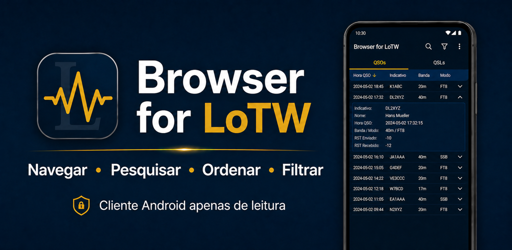
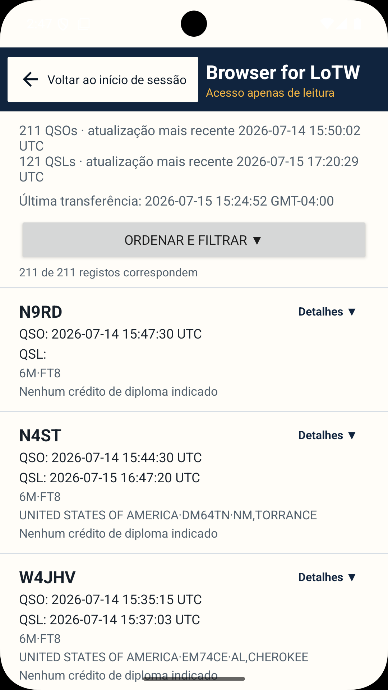
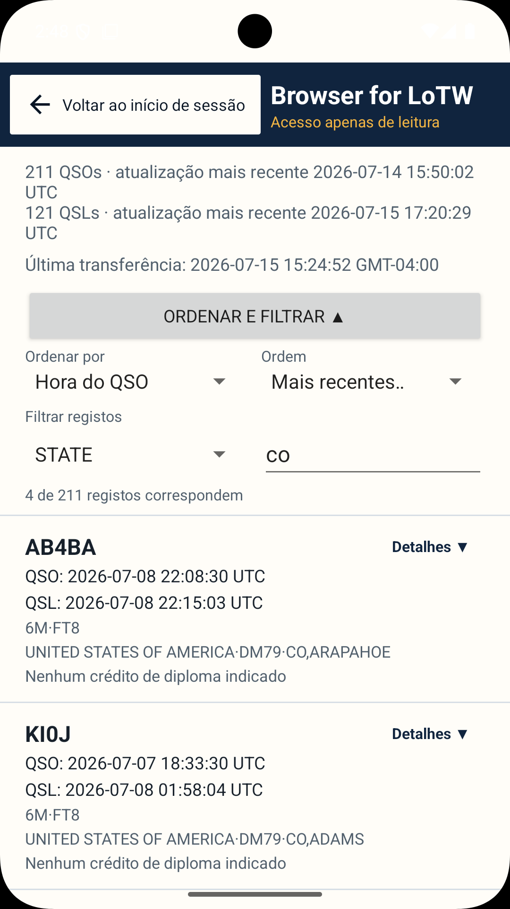
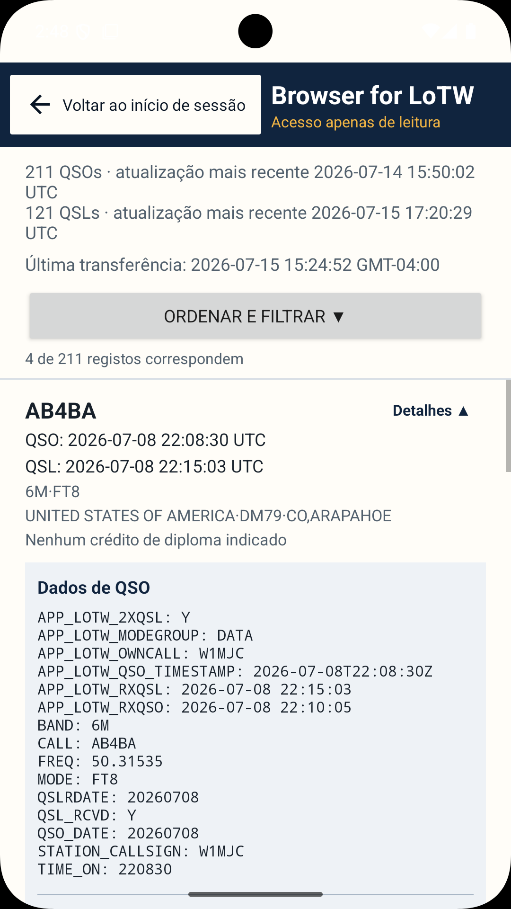
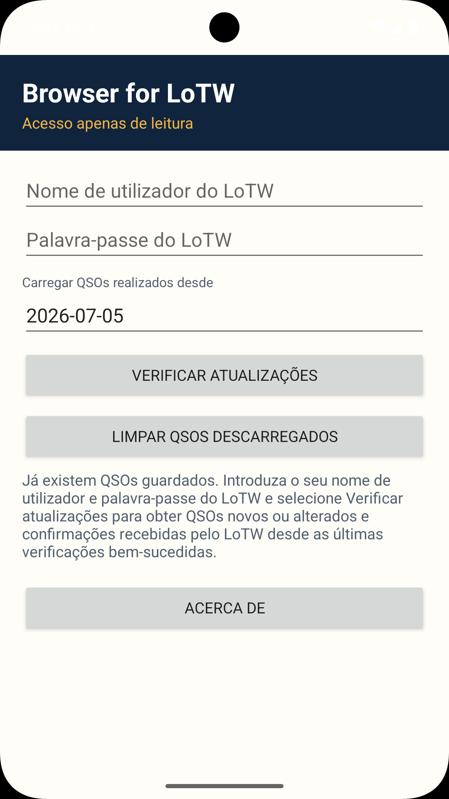
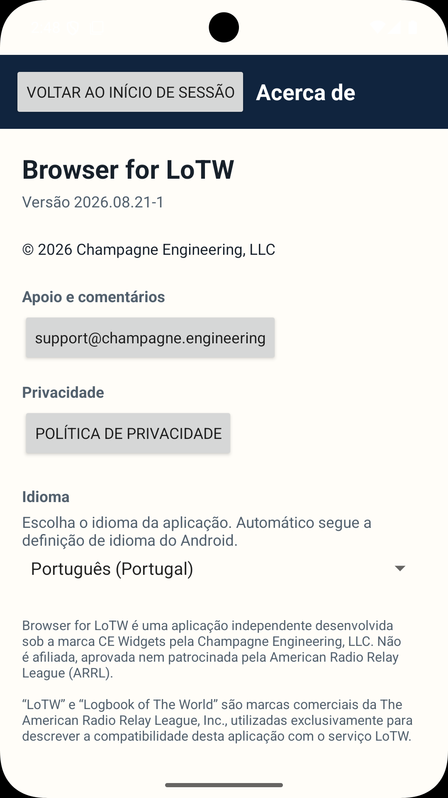

# Browser for LoTW

[English](README.md) · [Deutsch](README.de.md) · [Français](README.fr.md) · **Português** · [Italiano](README.it.md) · [Español](README.es.md)

**Estado:** 🟢 Produção · **Versão:** `2026.08.21-1`

Uma aplicação Android para consultar, pesquisar, ordenar e filtrar registos do ARRL Logbook of The World (LoTW).

[Disponível no Google Play](https://play.google.com/store/apps/details?id=engineering.champagne.browserforlotw)

## Capturas de ecrã

    

A documentação técnica completa e os avisos legais estão disponíveis em [inglês](README.md).
